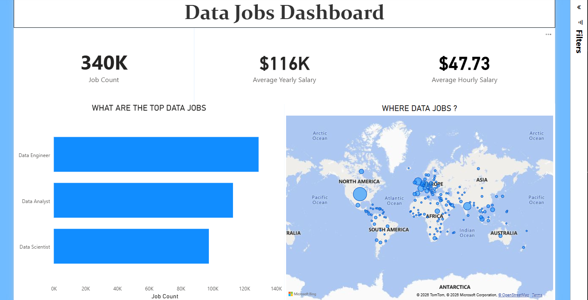

# Customer Retention & Churn Analysis Dashboard w/ Power BI

## Introduction

The **Customer Retention & Churn Analysis Dashboard** is an interactive business intelligence solution developed using **Power BI** to monitor, analyze, and predict customer churn behavior. The dashboard provides actionable insights into retention rates, churn drivers, customer lifetime value, engagement patterns, and segment-level risk profiles.

As customer acquisition costs continue to rise across industries, retaining existing customers has become a strategic priority. Organizations in telecommunications, SaaS, banking, e-commerce, and subscription-based services must understand why customers leave and which segments are most at risk. This dashboard equips business leaders, marketing teams, customer success managers, and product teams with the data needed to design proactive retention strategies and reduce revenue leakage.

---

## Skills Showcased

- **Data Cleaning and Transformation** – Cleaned and structured raw customer data, including contract details, usage logs, payment history, and support interactions, using Power Query and data modeling techniques.
- **Data Visualization** – Designed interactive visualizations to track churn rates, identify at-risk customer segments, and highlight key retention drivers in a clear and actionable format.
- **Business Intelligence (BI)** – Leveraged Power BI to consolidate multiple customer touchpoints into a unified view, transforming fragmented operational data into strategic business insights.
- **Data Analysis** – Performed cohort analysis, customer lifetime value estimation, and churn driver identification using historical behavioral and demographic data.
- **Dashboard Design** – Built an intuitive, user-friendly dashboard layout with slicers, drill-through pages, and dynamic KPIs to support stakeholder decision-making across departments.

---

## Conclusion

The Customer Retention & Churn Analysis Dashboard successfully converts raw customer behavioral and transactional data into meaningful, retention-focused insights using Power BI. By combining interactive visuals with deep data-driven analysis, the dashboard provides a comprehensive view of churn dynamics, at-risk customer profiles, key dissatisfaction indicators, and intervention opportunities. This empowers organizations to transition from reactive customer retention efforts to proactive, insight-led strategies that preserve revenue and strengthen long-term customer relationships.